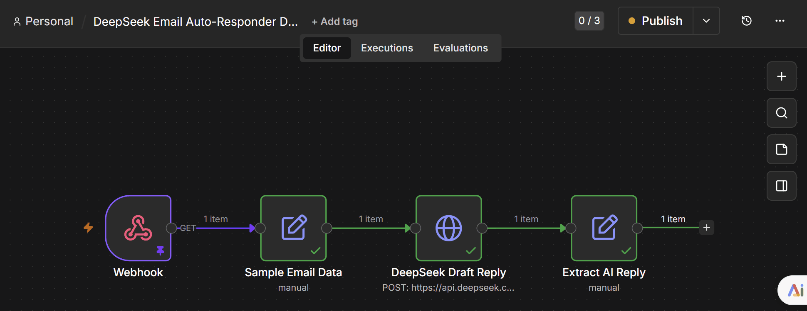

# AI Automation Templates for n8n

> Ready-to-use AI workflows for small businesses. Import, configure, save hours every week.



## What's Inside

### Free Templates (this repo)

| Template | What it does | Time saved |
|----------|-------------|------------|
| [AI Email Auto-Responder](templates/free/ai-email-auto-responder.json) | Auto-reply to customer emails with AI | 2-3 hrs/day |
| [Social Media AI Publisher](templates/free/social-media-ai-publisher.json) | Generate & publish daily posts automatically | 1-2 hrs/day |
| [Lead Capture + AI Scoring](templates/free/lead-capture-ai-scoring.json) | Score incoming leads 1-10, notify on hot ones | 3-5 hrs/week |
| [DeepSeek Email Demo](templates/free/deepseek-email-demo.json) | Same as Email Auto-Responder, uses DeepSeek API | — |

### Pro Templates ($29)

| Template | What it does |
|----------|-------------|
| **AI Customer Support Bot** | Webhook receives ticket → AI classifies intent/sentiment/urgency → auto-reply or escalate to team → log to Google Sheets |
| **AI Invoice Processor** | Webhook receives invoice → AI extracts vendor/amount/category → logs to Sheets → alerts team on high-value invoices |
| **AI Content Repurposer** | Input one article → AI generates Twitter thread + LinkedIn post + Newsletter + Instagram caption → saves to content queue |
| **AI Lead Nurture Sequence** | New lead comes in → AI scores 1-10 → auto-sends 3-email nurture sequence (Day 0, 3, 7) → logs lead to Sheets |

📧 **Get Pro templates**: Email [xinshidai2049@qq.com](mailto:xinshidai2049@qq.com) — includes all 4 Pro templates + setup guide. Pay securely via credit card.

## Quick Start (5 minutes)

### Prerequisites
- [n8n](https://n8n.io/) installed (free, self-hosted)
- An AI API key (Claude, OpenAI, or DeepSeek)
- Gmail account (for email templates)

### Steps
1. **Install n8n**
   ```bash
   docker run -it --rm -p 5678:5678 -v n8n_data:/home/node/.n8n n8nio/n8n
   ```
   Or use [n8n cloud](https://app.n8n.cloud/) (free tier available)

2. **Import a template**
   - Open n8n → Settings → Import Workflow
   - Select any `.json` file from `templates/free/`

3. **Configure credentials**
   - Click each node → Add your API keys
   - Gmail nodes: Connect your Google account
   - AI nodes: Add your Claude/OpenAI API key

4. **Activate the workflow**
   - Toggle the workflow to "Active"
   - Done! It runs automatically.

## Why These Templates?

**The problem**: Small business owners spend 3-5 hours/day on repetitive tasks — answering similar emails, posting on social media, sorting through leads.

**The solution**: AI automation that handles the boring stuff while you focus on growing your business.

**What makes these different**:
- Not "connect two apps" Zapier-level automation
- Actual AI reasoning — reads context, makes decisions, writes human-like responses
- Works with any language (Claude auto-detects)
- Self-hosted = your data stays private

## Who's This For?

- Small business owners who want to automate without coding
- Freelancers looking to save time on admin
- Agencies wanting to offer AI automation to clients
- Anyone curious about practical AI workflows

## Pricing

| | Free | Pro ($29) |
|---|---|---|
| Templates | 4 | 4 advanced workflows |
| Updates | ✅ | ✅ |
| Support | Community | Email |
| Setup guide | ✅ | ✅ |

**Get Pro**: Email [xinshidai2049@qq.com](mailto:xinshidai2049@qq.com) to purchase. Pay with credit card, templates delivered via email.

## Contributing

Found a bug? Want to add a template? PRs welcome!

1. Fork this repo
2. Create your template
3. Submit a PR with a clear description

## License

MIT — use freely for personal and commercial projects.

---

**Questions?** Open an issue — I'll respond within a day.