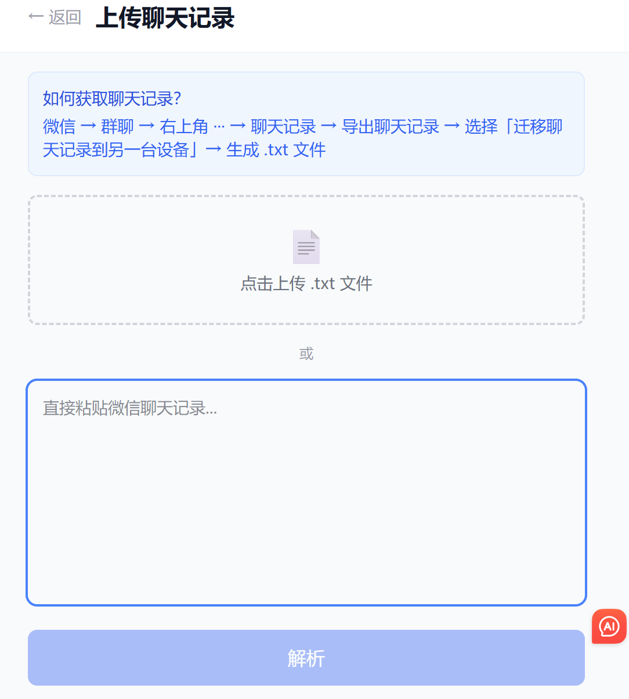

# 群精华板 v2 — Group Highlights

> 群里好东西，别丢了。

微信群有价值信息沉淀工具。**v2 升级**：批量上传聊天记录 → AI 自动分类 → 一键生成飞书文档。

## 解决什么问题

微信群里总有好内容，但刷屏太快、截图难搜、翻记录像大海捞针。

**群精华板**让群成员一起维护精华库：上传聊天记录导出文件，AI 按人/按话题自动分类，一键生成飞书在线文档分享给全群。

## v2 核心功能

- **批量上传**：解析微信 .txt 聊天记录导出文件，正则匹配消息头，自动拆分为单条
- **AI 分类**：DeepSeek API 按发送者或话题智能分类，保留完整原文不压缩
- **飞书文档**：一键生成飞书在线文档（@larksuiteoapi/node-sdk），自动设公开权限
- **邀请码准入**：管理员码（admin2026）可生成文档，成员码（group2026）可上传标记
- **单条标记**：看到好内容随手收录，不丢上下文
- **移动端优先**：微信浏览器直接打开即用

## 技术栈

Next.js 16 + TypeScript + Tailwind CSS + Supabase + DeepSeek API + 飞书 Open API

## 本地运行

```bash
cd group-highlights
npm install
# 编辑 .env.local，填入必需环境变量
npm run dev
```

打开 http://localhost:3000

## 环境变量

| 变量 | 说明 |
|------|------|
| `NEXT_PUBLIC_SUPABASE_URL` | Supabase 项目 URL |
| `NEXT_PUBLIC_SUPABASE_ANON_KEY` | Supabase 匿名密钥 |
| `DEEPSEEK_API_KEY` | DeepSeek API 密钥 |
| `FEISHU_APP_ID` | 飞书应用 ID |
| `FEISHU_APP_SECRET` | 飞书应用密钥 |
| `ADMIN_CODES` | 管理员邀请码 |
| `MEMBER_CODES` | 成员邀请码 |

## 线上地址

https://group-highlights.vercel.app/

## 截图



## 非技术背景，独立完成
